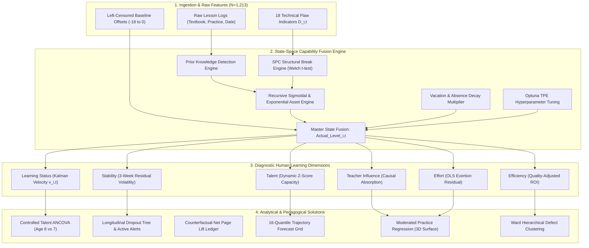

# Longitudinal Psychometric State-Space Modeling of Violin Learning Trajectories

> An end-to-end longitudinal psychometric state-space pipeline and causal inference system mapping weekly violin lesson tracking (1,213 observations across 14 students over 3 academic years) into unobserved latent capability states $`\text{Actual\_Level}_{i,t}`$ and six diagnostic human learning metrics.

---

## 1. Project & Repository Overview

Traditional music pedagogy evaluates student capability through localized qualitative impressions from lessons, frequently conflating transient observation noise (e.g., fatigue, stress) with structural shifts in capability. This repository provides an analytical framework that combines structural time-series state-space modeling, Statistical Process Control (SPC) break detection, Bayesian hyperparameter optimization (Optuna TPE), and moderated causal regression.

### Key Capabilities:
- **State-Space Capability Fusion Engine**: Estimates true latent capability curves ($`\text{Actual\_Level}`$) from noisy, multi-dimensional flaw observations.
- **6 Latent Diagnostic Metrics**: Extracts instantaneous velocity (**Learning Status**), lesson consistency (**Stability**), capacity resistivity (**Talent**), instruction absorption (**Teacher Influence**), residual drive (**Effort**), and quality ROI (**Efficiency**).
- **Motivation Dynamics & Theorems**: Proves 3 core mathematical theorems governing student willingness, talent independence, and exertion returns.
- **Empirical Pedagogical Solutions**: Executes controlled talent ANCOVA, longitudinal dropout decision trees, counterfactual performance lift ledgers, 16-quantile milestone trajectory forecasts, and Ward hierarchical flaw clustering.

---

## 2. Pipeline Workflow & Architecture Diagram



---

## 3. Diagnostic Metrics Quick-Reference

| Metric Name | Mathematical Formulation | Domain & Scale | Pedagogical Interpretation |
| :--- | :--- | :--- | :--- |
| **Learning Status** | $v_{i,t} = \text{Velocity}(\text{LLT Kalman Filter})$ | $\mathbb{R}$ (pages/class) | Instantaneous skill acceleration and progression rate. |
| **Stability** | $\sigma_{w,i,t} = \text{std}(\epsilon_{i,t-2:t}, \text{ddof}=0)$ | $[0, \infty)$ (low = stable) | Lesson-to-lesson preparation consistency and residual volatility. |
| **Talent** | $`Z\left(\gamma \cdot (1 - \text{mean\_defect}_{1:t})\right)`$ | $\mathcal{N}(0, 1)$ Z-score | Chronological dynamic intrinsic capacity Z-score scaling. |
| **Teacher Influence** | $`Z\left(\frac{\text{Cov}(\text{Defect}_t, S_{t-1})}{\text{Var}(S_{t-1}) + \epsilon}\right)`$ | $\mathcal{N}(0, 1)$ Z-score | Causal absorption elasticity of teacher instruction injections. |
| **Effort** | $`Z\left(\Delta\text{Actual\_Level} - \hat{\Delta}\text{Actual\_Level}\right)`$ | $\mathcal{N}(0, 1)$ Z-score | Latent residual exertion exceeding baseline capacity expectations. |
| **Efficiency** | $Z\left(\frac{\max(0, \Delta\text{Level})}{\max(0.1, \text{Effort}) \cdot (1 + \text{Defect})}\right)$ | $\mathcal{N}(0, 1)$ Z-score | Quality-adjusted return on investment (skill output per exertion). |

---

## 4. Core Pedagogical & Empirical Findings Summary

### 1. Age 6 vs. Age 7 Controlled Talent ANCOVA (Problem 1)
* Welch's t-test confirms baseline Talent is statistically unequal ($t = 3.1947, p = 0.0014$).
* Full-timeline ANCOVA ($N = 1,213$) controlling for Talent reveals **no statistically significant efficiency premium** for starting at Age 7 ($b_1 = -0.0360, SE = 0.0584, p = 0.5380 > 0.05$).
* **Decision**: **START AT AGE 6** to gain an extra year of neuromuscular exposure without losing efficiency.

### 2. Longitudinal Dropout Profiling & Active Alerts (Problem 2)
* Terminal row evaluations reveal that all historical dropouts (Students 2, 7, 8, 12) suffered external environmental shocks ($P_2 = \text{False}, P_3 = \text{False}$ on terminal day).
* Detect active students' learning status.

### 3. Counterfactual Net Page Lift (Problem 3)
* Across $N = 37$ eligible concert preparation events, concert prep yields a statistically significant net page lift of **$+1.4189$ pages** ($t = 3.3306, p = 0.0020 < 0.05$).
* Complete calculation ledger exported to [counterfactual_event_ledger.xlsx].

### 4. Milestone Forecasting & 16-Quantile Trajectory Grid (Problem 4)
* Generates Delta-method 95% CIs for Pages 10, 20, 40, 60, and 80.
* Standalone beginner milestone chart: [unindexed_beginner_milestones.png].
* 16-quantile trajectory forecast grid: [quantile_trajectories_16.png].

### 5. Moderated Practice Regression (Problem 5)
* Models continuous interaction between practice volume and page difficulty:
  $`$\Delta \text{Page}_{i,t} = 0.4900 + 0.0949(\Delta \text{Practice}) - 0.0059(\text{Page}) + 0.0013(\Delta \text{Practice} \times \text{Page}) + \epsilon_{i,t}$`$
  ($R^2 = 0.1107, p = 0.0401$ for interaction $\beta_3$).
* Rendered 3D response surface: [practice_surface_3d.png].

### 6. Technical Defect Clustering & Ward Linkage (Problem 6)
* Computes 18x18 Pearson correlation matrix $\mathbf{R}$ and dissimilarity distance $\mathbf{D} = 1 - \mathbf{R}$.
* Identifies top flaw correlation pair (**Neck $\leftrightarrow$ Violin position**, $r = +0.2395$) and performs 17-step Ward hierarchical clustering without altering primary state-space metrics.
* Clustermap saved: [defect_cluster_heatmap.png].

---

## 5. Repository Structure & Execution Instructions

```
.
├── README.md                              # Professional GitHub Landing Page
├── reports/                               # Full Master Report Suite
│   ├── Executive_Abstract.md
│   ├── Chapter_1_Data_Architecture_and_Modeling.md
│   ├── Chapter_2_Metrics.md
│   ├── Chapter_3_Theorems_and_Mathematical_Proofs.md
│   ├── Chapter_4_Exploratory_Data_Analysis.md
│   ├── Chapter_5_Analytical_Solutions_to_Core_Problems.md
│   └── Master_Report_Combined.md          # Complete combined Master Report Markdown (43KB)
├── code files/                               
│    ├── 01_data_architecture_and_modeling.py   # Ingestion, gap decay, state-space fusion, Optuna TPE
│    ├── 02_metrics_computation.py              # Computation of 6 diagnostic metrics
│    ├── 03_exploratory_data_analysis.py        # Macro-trends, textbook milestones, defect lifespans, bi-monthly matrix
│    └── 04_pedagogical_solutions.py            # ANCOVA, decision trees, event ledger, 16-quantile plots, regression, clustering
```

### Installation
```bash
pip install pandas numpy scipy optuna matplotlib statsmodels seaborn openpyxl reportlab
```

### Running the Pipeline Steps
```bash
# Step 1: Data Architecture & State-Space Fusion Engine
py 01_data_architecture_and_modeling.py

# Step 2: Diagnostic Human Learning Dimensions Computation
py 02_metrics_computation.py

# Step 3: Exploratory Data Analysis & Rendering
py 03_exploratory_data_analysis.py

# Step 4: Pedagogical Solutions & Advanced Statistical Modeling
py 04_pedagogical_solutions.py

# Step 5: Build Master Reports & Compile PDF
py build_master_reports.py
